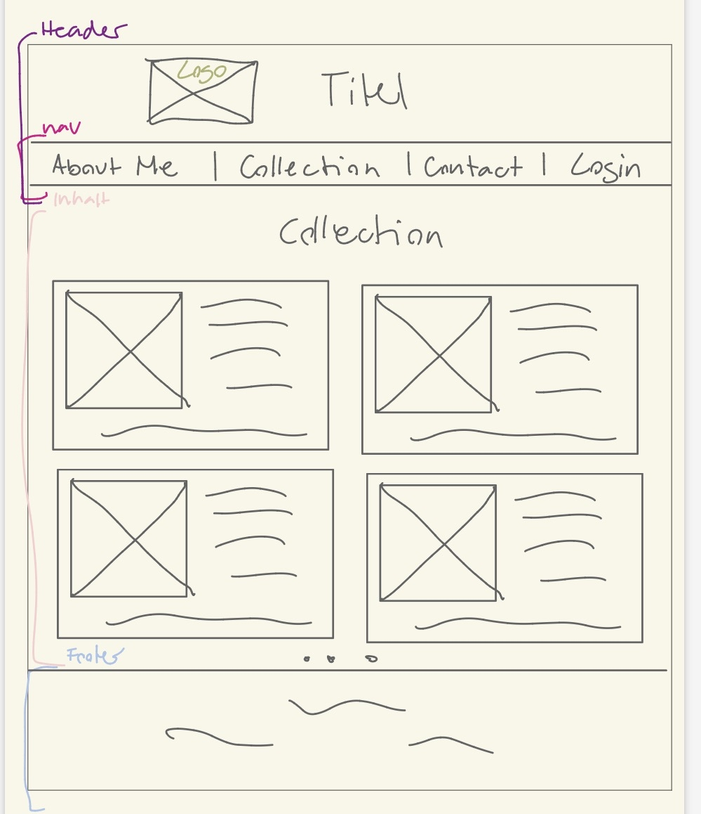
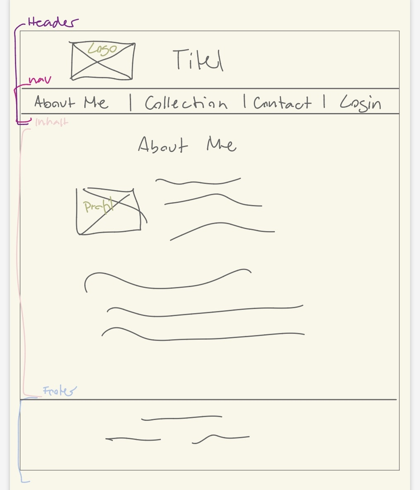
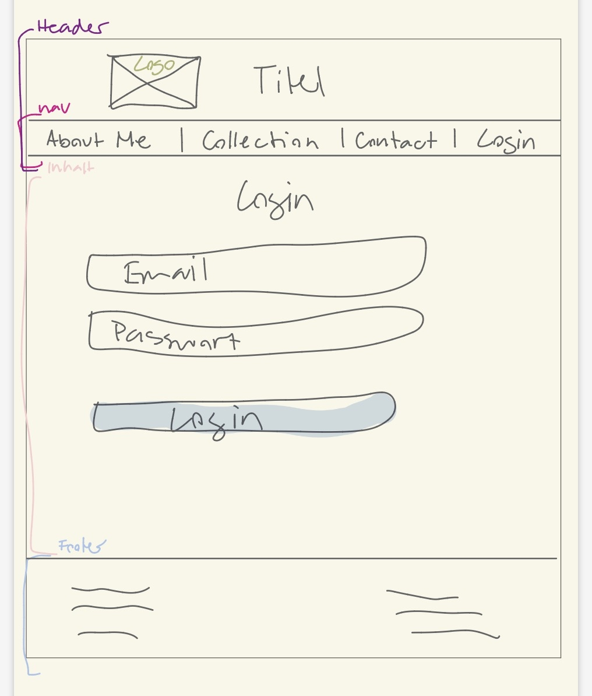
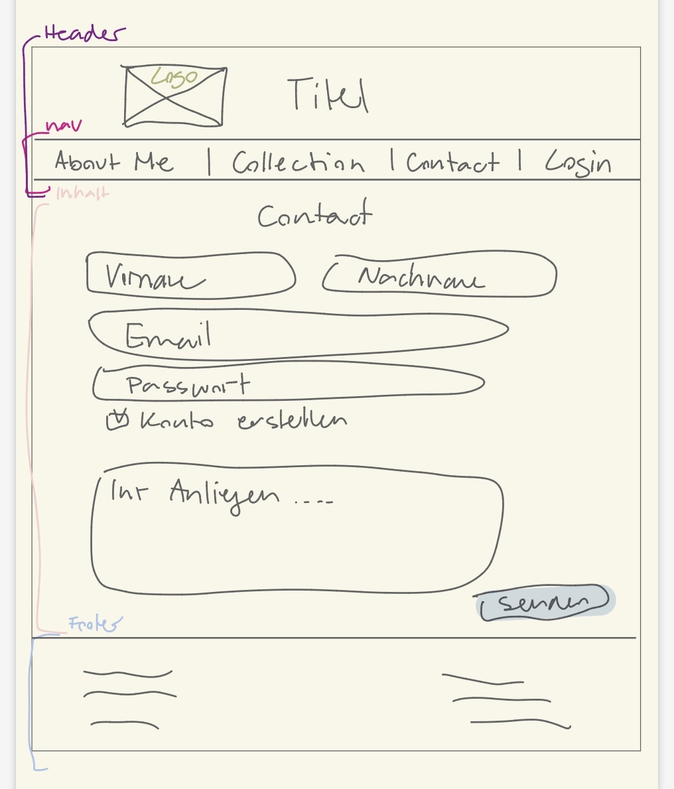

# Webseite über Taylor Swift

## Beschreibung der Webseite
Meine Webseite ist eine Fan-Seite für Taylor Swift, daher auch der Name „Taylor’s Version“. Auf dieser Seite kannst du mehr über Taylor Swift erfahren und dir ihre Alben mit zusätzlichen Informationen genauer anschauen. Außerdem hast du die Möglichkeit, dich mit mir in Kontakt zu setzen, wenn du mehr über Taylor wissen möchtest oder dich einfach mit einem anderen Fan austauschen willst.

Aus diesem Grund gibt es auch die Möglichkeit, einen Account zu erstellen, damit der Austausch noch einfacher und persönlicher wird.

## Wireframe
 
 
 
 

## Styleguide
* Logo -> Simples Logo welches die Farben der Webseite & das Kürzel des Namens "Taylor Swift" nochmals aufbring. 
     
    
* Farbschema
 
    * Weiss
    * Beige = #F7E1D7
    * Helles Rosa = #EDAFB8
    * Dunkles Rosa = #D96A85
    * Grau = #4A5759

* Typographie
    * Arial = Ich habe mich für die Schriftart Arial entschieden, da sie sehr klar, gut lesbar und modern wirkt.
    * Textgrösse normal (1.05rem) = Diese Grösse sorgt für eine angenehme Lesbarkeit im Fliesstext, ohne zu gross oder zu klein zu wirken.
    * Titel grösser (2–3rem) = Grössere Überschriften helfen dabei, Inhalte klar zu strukturieren und wichtige Bereiche der Webseite hervorzuheben.

